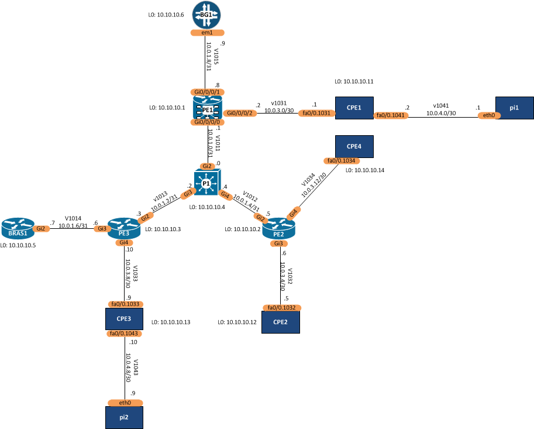

# Deploy MPLS/VPN Services
These playbooks are submissions for 'exercise 3 - Data Models' as part of the Building Network Automation Solutions course on ipspace.net.

## Overview
The overall objective of the playbooks is to deploy enterprise L3VPN services onto a service provider IP/MPLS core network. The L3VPN service should be built on the PE and CE routers using the data models defined in **fabric.yml** and **services.yml**.

- fabric.yml: defines the IP/MPLS core infrastructure parameters in YAML format. 
- service.yml: defines the L3VPN service parameters in YAML format.

The following diagram represents the test platform for the playbook development.

---
## Data Model 
The fabric and service data models are used as input the the **create_data_model.yml** playbook. This playbook produces a **nodes.yml** file extracting per-node data from the two input data models using the **nodes.j2** template to transform the service and fabric data into a node data model. This simplifies the deployment playbook (explained below). 

### Infrastructure Data Model
The **fabric.yml** data model is divided into two main sections:

- **nodes**: a dictionary of MPLS nodes stored based on their function. Node types include `pe`, `ce` and `p` router. Each type of router will have a number of nodes, each with node name, routerid, AS number and IPv4 mgmt address.      
- **links**: a list of core IP intra-AS links. Each link has an `a_end` and `b_end` representing the hostnames of the two endpoints. Interfaces of the two endpoints are stored in `a_end_intf` and `b_end_intf`. The IP prefix and cost on the link are in `link_ip_prefix` and `cost` respectively.

### L3VPN Service Data Model
The **service.yml** data model represents the MPLS services supported on the service provider core network. The example only outlines 'l3vpn', but the data model could support L2VPN and pseudowire type services.

- **services**: a dictionary of MPLS services
  - **l3vpn**: a dictionary of L3VPN products offered to enterprise customers
    - **wan**: a list of customer VRF's built as a full-mesh L3VPN WAN. Each VRF has a `vrf_name`, `description`, `customer` name along with the BGP/MPLS core config parameters such as `rd`, `rt_import` and `rt_export`. The WAN will interconnect one or more customer sites, represented in `sites` which is a list customer premises each containing `site_name`, `a_end` and `b_end` of the nodes connecting the site to the core. The link interfaces and IP prefix are stored in `a_end_intf`, `b_end_intf` and `wan_ip_prefix`. BGP routing protocol will run between the PE and CE to exchange routing information. In this service, all customers have a unique BGP AS number which is shared across the customers sites. This requires the uses of communities to provide the BGP loop prevention mechanism.    
    - **internet**: a list of one shared VRF that provides a shared Internet service for enterprise customers. The only difference between the `wan` and `internet` service is that `customer` name and BGP `asn` are defined at the `site` level as the overall VRF is not for one specific customer. In addition, the RIPE IP address assignment is recorded in the value of `public_ipv4`  

---

## Deploy BGP
The **deploy_wan_ebgp.yml** playbook will create the EBGP configuration and BGP MPLS/VPN configuration. The deployment playbook expects the **nodes.yml** data model as input.

Basic templates are included for IOS PE's and will be updated as part of ongoing development of the solution, also further updates required including:
- IOS-XR config template for pe1.pk.lab
- CE configuration template
- The BGP communities are not include in the template configuration.
