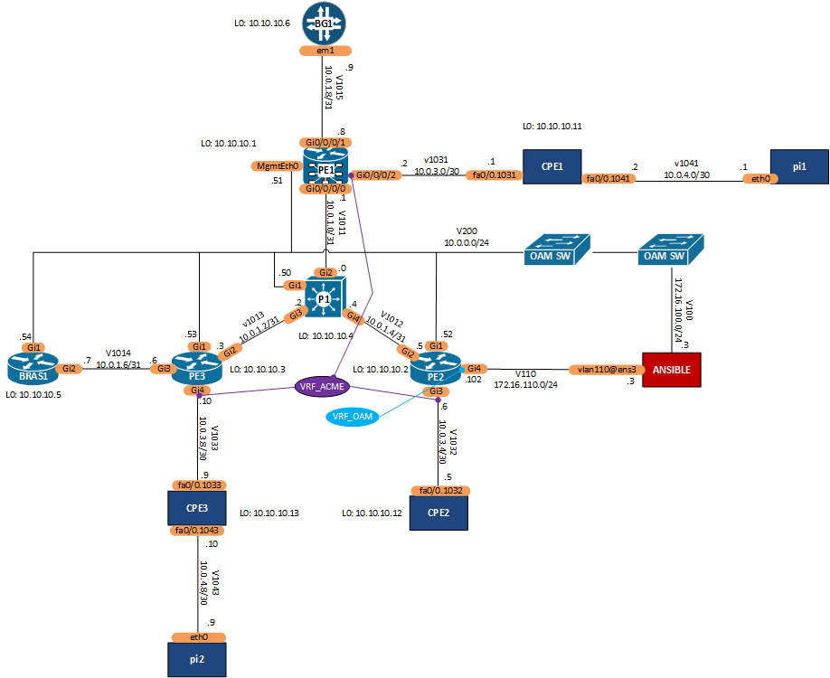

# Deploy MPLS/VPN Services
These playbooks are submissions for 'exercise 3 - Data Models' as part of the Building Network Automation Solutions course on ipspace.net.

## Overview
The overall objective of the playbooks is to deploy MPLS infrastructure and internal services onto a service provider IP/MPLS core network to provision and deploy enterprise L3VPN services. 

The L3VPN service should be built on the P, PE and CE routers using the data models defined in **data_models** folder. 

## Logical Diagram
The following diagram represents the test platform for the playbook development.

---
## Data Model 
All data models are stored in the **data_models** folder.

- Infrastructure: defines the IP/MPLS core infrastructure parameters. 
- Enterprise L3VPN: defines the enterprise L3VPN service parameters.

### Infrastructure 
All infrastructure data models are in YAML format. The fabric, common and intra-service data models are used as input the the **create_data_model.yml** playbook. This playbook produces a **nodes.yml** file extracting per-node data from the two input data models using the **nodes.j2** template to transform the service and fabric data into a node data model. This simplifies the deployment playbook (explained below). 

- fabric.yml: defines the IP/MPLS core infrastructure parameters. 
- intra-service.yml: defines the internal OAM L3VPN service parameters.
- common.yml: defines the common network services deployed in the core network.
- nodes.yml: dynamically generated per-node data model for core routers.

#### Fabric Data Model
The **fabric.yml** data model is divided into two main sections:

- **nodes**: a dictionary of MPLS nodes stored based on their function. Node types include `pe`, `ce` and `p` router. Each type of router will have a number of nodes, each with node name, 'routerid', 'asn' and IPv4 'mgmt' address.      
- **links**: a list of core IP intra-AS links. Each link has an `a_end` and `b_end` representing the hostnames of the two endpoints. Interfaces of the two endpoints are stored in `a_end_intf` and `b_end_intf`. The IP prefix and cost on the link are in `link_ip_prefix` and `cost` respectively.

#### L3VPN Intra Service Data Model
The **intra-service.yml** data model represents the internal L3VPN services for management. A sample VRF_OAM service is created. Intra-services are imported along with the **fabric.yml** when building the per-node data model. These services will be stored in the 'vrfs' for each node in the **nodes.yml** file.

- **intra_services**: a dictionary of internal MPLS services
  - **l3vpn**: a dictionary of L3VPN management services
    - **oam**: a list of internal VRF's built as a central services L3VPN. Each VRF has a `vrf_name`, `description`, `customer` name along with the BGP/MPLS core config parameters such as 'remote_asn',  `rd`, `rt_import` and `rt_export`. The WAN will interconnect one or more core nodes, represented in `nodes` dict which is a key/value structure of IP routers and their 'interface' that is connected to the service. IP address for interfaces for this service are retrieved from the 'mgmt' field of each node.     

#### Common Services Data Model
All common network services are described in the **common.yml**. Potential services include 'snmp', 'syslog', 'ntp' and 'dns'. These services are deployed on all core nodes.

### Enterprise L3VPN 

- service.yml: defines the enterprise L3VPN service parameters for each customer order.
- cpe_nodes.yml: per-node data model for customer equipment dynamically generated from the services data model.

#### L3VPN Service Data Model
The **service.yml** data model represents the MPLS production services supported on the service provider core network. The example only outlines 'l3vpn', but the data model could be extended to support L2VPN and pseudowire type services.

- **services**: a dictionary of MPLS services
  - **l3vpn**: a dictionary of L3VPN products offered to enterprise customers
    - **wan**: a list of customer VRF's built as a full-mesh L3VPN WAN. Each VRF has a `vrf_name`, `description`, `customer` name along with the BGP/MPLS core config parameters such as `rd`, `rt_import` and `rt_export`. The WAN will interconnect one or more customer sites, represented in `sites` which is a list customer premises each containing `site_name`, `a_end` and `b_end` of the nodes connecting the site to the core. The link interfaces and IP prefix are stored in `a_end_intf`, `b_end_intf` and `wan_ip_prefix`. BGP routing protocol will run between the PE and CE to exchange routing information. In this service, all customers have a unique BGP AS number which is shared across the customers sites. This requires the uses of communities to provide the BGP loop prevention mechanism.    
    - **internet**: a list of one shared VRF that provides a shared Internet service for enterprise customers. The only difference between the `wan` and `internet` service is that `customer` name and BGP `asn` are defined at the `site` level as the overall VRF is not for one specific customer. In addition, the RIPE IP address assignment is recorded in the value of `public_ipv4`  

#### CPE Node Data Model
Customer Premise Equipment (CPE) is required to provide the service demarcation at the customer site. The 'cpe_router' role will generate the **cpe_nodes.yml** data model. 

Each CPE will have a `customer`, 'routerid', 'asn' and IPv4 'mgmt' address. The 'interfaces' dict contains the WAn interfaces and their assocaited 'cost', 'ip' and 'service_type' e.g. (wan/Internet). In addition, the 'remote_intf', 'remote_node' and 'remote_vrf' detail the remote end of the WAN interconnection into the MPLS core network at the PE router.

No LAN interfaces are considered in the data model as their implementation is customer specific for now. 

## Roles
The following roles were used:
- 'ansible-pyats': imported from Cisco DevNet to supported parsing of IOS/IOS-XR CLI commands into structured data
- 'cpe_router': created a CPE role to facilitate the creation of a service entity at a customer site

## Templates
All jinja2 templates are stored in the **templates** folder

## Tasks
Additional ansible tasks are stored in the **tasks** folder. Usually these tasks were required due to nested loops or to support multi-os task invocation i.e. ios-xe or ios-xr operational tasks with different implementation. 

## Results
All configuration outputs are stored in the **results** folder.

- 'config': core node config
- 'cpe': full CPE config
- 'reports': deployment validation reports 
- 'ping_test': IP reachability reports for enterprise service deployment
- 'vrf_reports': diff reports for existing and intended L3VPN services 

## Learning
- services.yml data model was cumbersome to traverse. Additional loops required to loop between service types. A better option might be to capture 'type' as an attribute of VRF. 
- Different data model per service type also required more business logic in the templates to determine the service. This is unavoidable due to the nature of the shared L3VPN among many customers and a dedicated L3VPN for one customer e.g. shared VPN has the 'customer' and 'asn' attributes at 'site' level, whereas the dedicated VPN has the 'customer' and 'asn' attributes at 'vrf' level. However, a data model should be consistent to reduce the complexity associated with processing. 
- splitting the playbook into multiple plays meant I had to import the data models for each play (using 'var_files'), which seems like a waste of processing.
