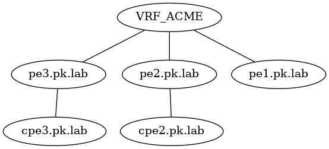

# Reporting

## Basic L3VPN Topology
These playbooks gather BGP MPLS VPN data from an IOS-XE PE node and extract VRF and IP information using the Cisco pyATS framework. 

The following basic data model was used to describe the L3VPN

 
 L3VPN topology sample in DOT file format
 
 
